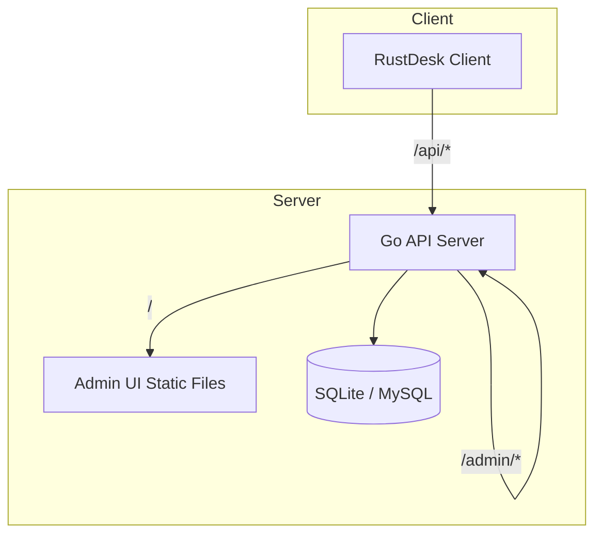
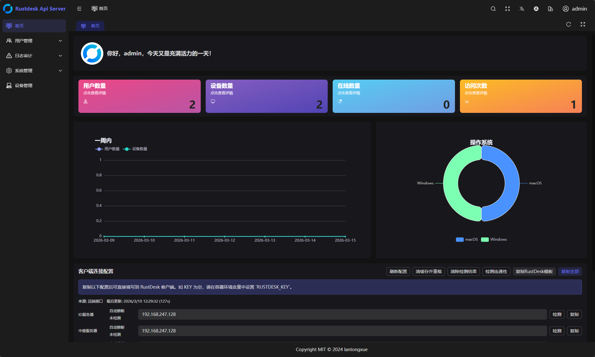

# RustDesk API Server Pro（兼容增强版）

[English](./README_EN.md)

RustDesk API Server Pro 是一个面向 RustDesk 客户端的第三方 API 服务端实现，包含管理后台前端（`soybean-admin`）。当前版本以“兼容增强”为目标，优先覆盖最新客户端主流程所需的 API，并尽量保持部署轻量与可维护。

🚨 <span style="color:red;">本项目部分内容由 ChatGPT 生成，仅供参考；请在生产环境前务必自行验证、严格测试，并依据业务需求谨慎调整。</span>

本文档为中文详细版，包含功能清单、架构图、部署步骤、配置说明、截图、FAQ 与 License。更细的专项文档请见文末文档索引。

## 最近更新

- **当前开发状态**（版本以 `VERSION` 为准）
  - 客户端 WebAuth 按官方轮询协议直接取得认证体，浏览器协议唤醒仅作为可选的返回按钮
  - Web 后台 OAuth/OIDC 使用一次性 ticket，成功后等待用户信息就绪再进入目标页面
  - OAuth 回调错误统一使用 `ERR-22xx`，所有控制器错误出口保证带错误码
  - 新增 `AdminOrUserAuth` 中间件，支持管理员或普通用户访问
  - 15个操作类API添加 isAdmin 检查，防止普通用户执行管理操作
  - 前端路由和按钮添加权限控制
- 兼容 RustDesk 客户端 1.4.9 主流程 API
- 补齐地址簿兼容别名：`/api/ab/get`、`/api/ab/shared-profiles`、`/api/ab/shared/profiles`、`/api/ab/shared_profiles`
- 修复共享地址簿跨用户读取和写入归属：共享读取可访问 owner 数据，写入需 owner 或 `rule >= 2`
- 对齐官方客户端新增 peer 时的 `same_server` 布尔/null/缺省请求形态
- 修复心跳响应 `modified_at`：未分配策略时回显客户端值，避免触发持续策略重同步
- 新增"我的同步设备"菜单：管理员可查看所有设备，普通用户可登录查看自己的同步设备
- 完善“通讯录”菜单：联系人和标签一次展示当前账户下全部地址簿数据，以地址簿名称列和表头筛选切换视图；地址簿、联系人、标签支持 CSV 批量导入导出
- 管理员可为指定用户创建地址簿；普通用户只能创建自己的地址簿，且不能删除管理员代建的地址簿
- 新增“关于与更新”页面：显示运行版本和兼容版本，在线更新检查地址可修改并保存在浏览器
- 新增版本自动递增系统：每次 CI 构建自动递增 PATCH 版本号（VERSION 文件为单一事实来源）
- 首页更新日志区域显示服务端版本号与构建时间，方便确认是否更新成功
- Docker 镜像发布改为质量门禁后执行：推送到 `main` 后，线上流程全部成功才自动推送 GHCR（`latest` + `main` + `sha-xxx` 标签）
- 修复管理员 `/userinfo` API 未返回 `roles` 导致前端菜单过滤异常的问题
- 修复 `CompatSysinfoVersion` 从常量改为函数后 `/api/status` 缺少调用括号返回 400 的问题
- 修复 `start.sh` 未导出 `BUILD_TIME` 环境变量的问题
- 补充 OpenWrt / x86 软路由一体化部署与对齐更新脚本，默认使用 host 网络、`/mnt/docker` 数据目录、中文 label 与端口 label
- 刷新 Docker 文档，明确当前推荐为单容器一体化部署，旧 `rustdesk-web` 前端容器不再是必需组件
- 新增后台第三方登录支持：`oidc`、`google`、`github`、`qq`
- 修复第三方登录在反向代理或多入口环境下可能出现的 `state invalid or expired` 问题

## 目录

- 项目概述
- 功能清单
- 架构图
- 目录结构
- 快速开始
- 配置说明（server.yaml）
- 端口与访问路径
- 管理后台与账号
- 第三方登录
- 数据与持久化
- 部署建议（生产）
- 升级与迁移
- 常见问题与排查
- 截图
- 文档索引
- License

## 项目概述

本项目由 Go 后端与 Vue 管理后台组成，采用单 HTTP 端口对外提供服务：

- RustDesk 客户端调用的 API（`/api/*`）
- 管理后台接口（`/admin/*`）
- 管理后台前端静态页面（`/`）

默认使用 SQLite，也支持 MySQL。配置文件统一为 `backend/server.yaml`（容器内为 `/app/data/server.yaml`）。

当前 Docker 镜像已内置管理后台前端 `dist`，推荐部署为单容器一体化服务。旧的独立 `rustdesk-web` / nginx 前端容器不再是必需组件，升级时应避免继续访问旧前端。

## 功能清单

- RustDesk 客户端主流程 API 兼容增强（兼容 1.4.9）
- 地址簿读写、共享地址簿、备注字段 `note` 与 `same_server` 兼容
- 设备列表、用户列表、审计日志基础能力
- 我的同步设备：管理员查看所有设备，普通用户查看自己的设备
- 通讯录：联系人全量视图、地址簿管理、标签全量视图、表头筛选和 CSV 批量导入导出
- 心跳、sysinfo、devices/cli 的最小兼容实现，心跳稳定回显客户端 `modified_at`
- 录屏上传 `record` 的最小落盘流程（`new/part/tail/remove`）
- 版本自动递增：CI 每次构建 PATCH 版本号 +1，VERSION 文件为单一事实来源
- 首页显示服务端版本与构建时间
- 管理后台前端（`soybean-admin`）静态页面
- OIDC 与 plugin-sign 兼容占位接口（用于避免 404）
- SMTP 配置预留（用于后台通知/模板邮件场景）

说明：部分高级能力仍为兼容占位实现，详见“常见问题与排查”。

## 架构图



## 目录结构

- `backend/` Go 后端 API 服务
- `soybean-admin/` 管理后台前端（构建后由后端同端口提供）
- `docker/` 容器启动脚本与辅助文件
- `docs/` 使用、端口、Docker、OpenWrt 对齐更新、排障文档
- `docker-compose.yaml` Docker Compose 示例
- `Dockerfile` 容器镜像构建文件

## 快速开始

以下步骤会在首次启动时执行数据库同步（`sync`）。

### 方式一：二进制部署

1. 构建后端

```powershell
go build -o rustdesk-api-server-pro.exe .
```

2. 准备配置 `backend/server.yaml`

3. 同步数据库结构

```powershell
./rustdesk-api-server-pro.exe sync
```

4. 启动服务

```powershell
./rustdesk-api-server-pro.exe start
```

访问管理后台：`http://<服务器IP>:<端口>/`

### 方式二：Docker Compose（推荐）

```bash
mkdir -p /opt/rustdesk-api-server-pro/data
cd /opt/rustdesk-api-server-pro

# 准备 server.yaml（可从仓库示例复制并修改）
curl -L -o server.yaml https://raw.githubusercontent.com/liyan-lucky/rustdesk-api-server-pro/main/backend/server.yaml

cat > docker-compose.yaml <<'YAML'
services:
  rustdesk-api-server-pro:
    container_name: rustdesk-api-server-pro
    image: ghcr.io/liyan-lucky/rustdesk-api-server-pro:latest
    environment:
      - "ADMIN_USER=admin"
      - "ADMIN_PASS=ChangeMe123!"
    volumes:
      - ./server.yaml:/app/server.yaml
      - ./data:/app/data
    network_mode: host
    restart: unless-stopped
    labels:
      name: "RustDesk API Server Pro"
      desc: "RustDesk API 增强服务端：管理后台前端、后端 API、第三方登录、SQLite 数据持久化"
      ports: "12345/tcp"
YAML

docker compose up -d
```

说明：`ADMIN_USER` 与 `ADMIN_PASS` 仅首次启动有效，用于自动创建管理员账号。

### 方式三：OpenWrt / x86 软路由一键对齐更新

```bash
curl -L -o /tmp/update-openwrt-one-container.sh \
  https://raw.githubusercontent.com/liyan-lucky/rustdesk-api-server-pro/main/docker/update-openwrt-one-container.sh

sh /tmp/update-openwrt-one-container.sh
```

默认使用 `/mnt/docker/rustdesk-api` 作为数据目录，并会备份旧数据、删除旧 `rustdesk-web` 前端容器、启动一体化服务。详见 `docs/OPENWRT_ONE_CONTAINER.md`。

## 配置说明（server.yaml）

关键配置位于 `backend/server.yaml`，容器内生效文件为 `/app/data/server.yaml`。

最小参考配置：

```yaml
signKey: "please-change-this-sign-key"
debugMode: false

db:
  driver: "sqlite"
  dsn: "./server.db"
  timeZone: "Asia/Shanghai"
  showSql: false

httpConfig:
  printRequestLog: false
  staticdir: "/app/dist"
  port: ":12345"

smtpConfig:
  host: "127.0.0.1"
  port: 1025
  username: ""
  password: ""
  encryption: "none"
  from: "noreply@example.com"
```

重点说明：

- `signKey` 必须修改，并且升级时保持固定
- `httpConfig.port` 为对外 HTTP 监听端口
- `httpConfig.staticdir` 为管理后台静态文件目录，Docker 镜像内应为 `/app/dist`
- SQLite 默认数据库位于运行目录下的 `server.db`
- MySQL 可通过切换 `db.driver` 与 `db.dsn` 使用

## 端口与访问路径

默认是单端口架构（示例 `:12345`）：

- 管理后台页面：`/`
- RustDesk 客户端 API：`/api/*`
- 管理后台接口：`/admin/*`
- plugin-sign 兼容接口：`/lic/web/api/plugin-sign`

当 `/api` 可用但首页 404 时，请优先检查 `httpConfig.staticdir` 是否正确。

## 管理后台与账号

- 管理后台入口：`http://<host>:<port>/`
- Docker 首次启动时若设置 `ADMIN_USER` 与 `ADMIN_PASS` 会自动创建管理员
- 若需手动调整账号，请在容器内使用管理命令或修改数据库

## 第三方登录

第三方登录统一使用可扩展 Provider 架构，前端登录页会自动展示已启用的 Provider。GitHub 与 QQ 已完成协议适配；Google 和通用 OIDC 保持兼容。

管理员应优先在后台“第三方登录”页面添加、编辑、启用和检查 GitHub 配置；页面会给出可复制的回调地址。Client Secret 保存后仅显示 `********` 加末 8 位作为识别提示，接口不会返回明文，未修改提示直接保存会保留原值。`server.yaml` 仅保留用于旧版本兼容、自动化部署和后台无法访问时的故障恢复。

- 传统单 provider：`oidc`
- 多 provider：`oauth.providers`
- 内置 provider 类型：`oidc`、`google`、`github`、`qq`

说明：

- 旧版 `oidc` 配置仍然保留兼容
- 新版推荐使用 `oauth.providers`
- 登录成功后仍走后台原有 token 体系，不会额外引入前端独立会话机制
- `accountRole: admin|user` 决定只能绑定对应角色，禁止跨角色匹配
- 若开启 `bindByEmail: true`，GitHub 只使用官方 API 返回的已验证邮箱绑定已有账号
- 自动创建默认关闭；管理员使用 `autoCreateAdmin`，普通用户使用 `autoCreateUser`
- GitHub 授权使用 PKCE S256，state 与 ticket 为数据库持久化的一次性短期凭据
- QQ 登录按 OpenID 绑定，不依赖邮箱；QQ Connect 不支持 PKCE，仍使用数据库持久化的一次性 state 和 ticket 防止 CSRF 与回放
- OAuth/OIDC 回调使用 `/#/` hash 路由；失败固定回到登录页，并区分账户不可绑定、Provider 不可达和 state 过期等错误
- 微信、Gitee 等国内 Provider 当前仍为计划项；QQ 已完成协议适配，真实可用性仍需使用已审核应用完成回调验收

`backend/server.yaml` 示例：

```yaml
oauth:
  providers:
    - type: "google"
      name: "google"
      displayName: "Google"
      enabled: true
      clientId: "YOUR_GOOGLE_CLIENT_ID"
      clientSecret: "YOUR_GOOGLE_CLIENT_SECRET"
      bindByEmail: true
      autoCreateAdmin: false

    - type: "github"
      name: "github"
      displayName: "GitHub"
      enabled: true
      clientId: "YOUR_GITHUB_CLIENT_ID"
      clientSecret: "YOUR_GITHUB_CLIENT_SECRET"
      redirectUrl: "https://desk.example.com/admin/auth/oauth/github/callback"
      scopes: ["read:user", "user:email"]
      accountRole: "admin"
      bindByEmail: true
      autoCreateAdmin: false

    - type: "oidc"
      name: "company-sso"
      displayName: "Company SSO"
      enabled: true
      issuer: "https://sso.example.com"
      clientId: "YOUR_OIDC_CLIENT_ID"
      clientSecret: "YOUR_OIDC_CLIENT_SECRET"
      scopes: ["openid", "profile", "email"]
      bindByEmail: true
      autoCreateAdmin: false
```

默认回调地址规则：

- 新版多 provider：`/admin/auth/oauth/<provider>/callback`
- 旧版兼容 OIDC：`/admin/auth/oidc/callback`

如果你使用反向代理，请确保外部访问域名与回调地址保持一致，并建议传递 `X-Forwarded-Proto`、`X-Forwarded-Host`。

完整 GitHub OAuth App 注册、普通用户配置、安全边界和后续国内外 Provider 路线见 [第三方登录规范](docs/OAUTH_PROVIDERS.md)。

### 授权状态检查

```bash
curl http://127.0.0.1:12345/admin/auth/oauth/providers
curl "http://127.0.0.1:12345/admin/auth/oauth/url?provider=github"
```

预期结果：

- `providers` 返回非空数组，表示至少有一个 provider 已启用
- `url` 返回 `enabled: true` 且包含 GitHub 授权地址，表示后端配置和回调生成正常

若登录后出现“页面一闪又回到登录页”，请优先检查：

- GitHub OAuth App 的回调地址是否与服务端 `redirectUrl` 完全一致
- 实际访问入口与回调入口是否为同一条外部链路
- 当前镜像是否包含签名 state 修复；旧版本在容器重启、反代切换或多入口场景下容易出现 `state invalid or expired`
- 是否仍在访问旧 `rustdesk-web` 的旧前端 dist

GitHub 测试场景示例：

```yaml
oauth:
  providers:
    - type: "github"
      name: "github"
      displayName: "GitHub"
      enabled: true
      clientId: "YOUR_GITHUB_CLIENT_ID"
      clientSecret: "YOUR_GITHUB_CLIENT_SECRET"
      redirectUrl: "http://your-host:12345/admin/auth/oauth/github/callback"
      bindByEmail: true
      autoCreateAdmin: true
```

## 数据与持久化

建议持久化目录 `/app/data`，包含：

- `server.db`（SQLite）
- `server.yaml`（实际生效配置）
- `.init.lock`（首次初始化标记）
- `record_uploads/`（录屏文件）

未持久化将导致升级或重启后数据丢失。

## 部署建议（生产）

- 修改并固定 `signKey`
- 明确 `httpConfig.port`
- 使用反向代理（Nginx/Caddy）统一 80/443
- 如果从旧部署升级，删除或停用旧 `rustdesk-web` 前端容器
- 开启必要日志后排查完及时关闭 `printRequestLog`
- 使用最新 RustDesk 客户端完成冒烟验证

## 升级与迁移

每次升级建议执行：

```bash
rustdesk-api-server-pro sync
```

Docker 镜像启动脚本会自动执行 `sync`。升级后建议查看日志确认数据库同步成功。若数据库结构未同步，可能出现登录后部分页面报错、字段不存在等问题。

## 常见问题与排查

问题：管理后台首页打不开，但 `/api/*` 正常

原因：`httpConfig.staticdir` 指向错误或静态文件未构建

处理：Docker 镜像内确认 `staticdir` 指向 `/app/dist`

问题：升级后列表/审计页面报 SQL 字段不存在

原因：数据库未执行 `sync`

处理：执行 `sync` 并重启服务

问题：第三方登录按钮不显示

原因：可能仍在访问旧 `rustdesk-web` 的旧前端，或 `oauth.providers` 未启用 provider

处理：删除旧前端容器，只保留一体化 `rustdesk-api-server-pro`；检查 `/admin/auth/oauth/providers`

问题：RustDesk 客户端提示 404

原因：调用了尚未补齐的接口或使用旧二进制

处理：开启 `printRequestLog` 观察路径，升级服务到最新版本

问题：录屏上传失败

原因：`record_uploads/` 不可写或磁盘不足

处理：检查权限与磁盘空间

问题：OIDC / plugin-sign 无法使用

原因：当前为兼容占位实现

处理：如需完整功能需自行补齐逻辑

## 截图



## 文档索引

- 项目详细描述：`docs/PROJECT_DESCRIPTION.md`
- 经验教训与项目偏好：`docs/LESSONS_LEARNED.md`
- 使用说明：`docs/USAGE.md`
- Docker 说明：`docs/DOCKER.md`
- OpenWrt 一体化部署与对齐更新：`docs/OPENWRT_ONE_CONTAINER.md`
- 端口说明：`docs/PORTS.md`
- 排障手册：`docs/TROUBLESHOOTING.md`

## License

本项目使用 AGPL-3.0 许可证，详见 `LICENSE`。
